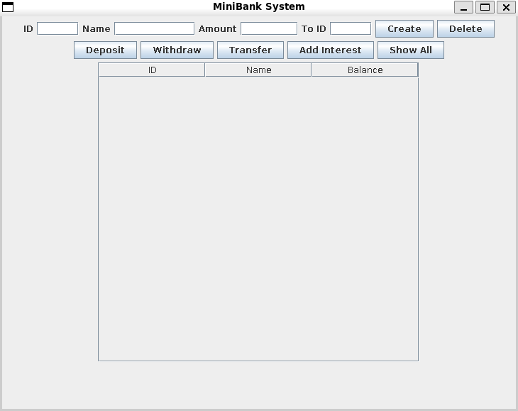
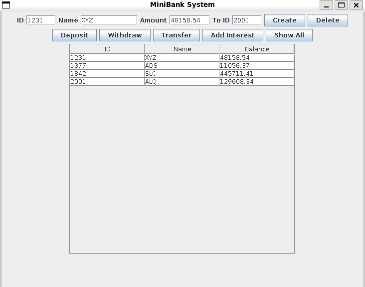

# MicroBank - Java Swing Banking System

MicroBank is a simple desktop banking application built using **Java Swing**. It allows users to perform basic banking operations through a graphical user interface, while storing data persistently using a JSON file.

---

## Features

* Create and delete bank accounts
* Deposit and withdraw money
* Transfer funds between accounts
* View all accounts in a tabular format (JTable)
* Basic transaction history per account
* Interest calculation (fixed rate of 0.05%)
* Data persistence using JSON file

---

## Technologies Used

* **Java (JDK 8+)**
* **Java Swing** (GUI)
* **JTable & DefaultTableModel**
* **File Handling (BufferedReader / PrintWriter)**
* **JSON (manual implementation, no external libraries)**

---

## Project Structure

```
micro-bank/
│── BankingSystem.java      # Main application (single-file project)
│── bank.json               # Data storage file (auto-generated)
│──.gitignore
│── README.md
```

---

## How to Run

1. Clone the repository:

   ```bash
   git clone https://github.com/oriental-eclipse/micro-bank
   cd micro-bank
   ```

2. Compile the program:

   ```bash
   javac BankingSystem.java
   ```

3. Run the application:

   ```bash
   java BankingSystem
   ```

---

## Usage

* Enter **Account ID, Name, and Amount**

* Use buttons to perform operations:

  * Create → creates a new account
  * Deposit / Withdraw → updates balance
  * Transfer → moves money between accounts
  * Show All → displays all accounts

* Data is automatically saved in `bank.json`

---

## Screenshots

### Main Interface


### Application Under Use


---

## Limitations

* No authentication system
* No encryption (not secure for real-world use)
* Transaction history is not persisted in JSON
* Basic UI (not optimized for responsiveness)

---

## Future Improvements

* Add login/authentication system
* Improve UI design (dark theme, layout)
* Store transaction history in JSON
* Add database support (MySQL / SQLite)

---

## Author

**Krishna Bhosle**

B.Tech(IT) Student

---

## References

* Java Swing Documentation (Oracle)
* Java SE API Documentation
